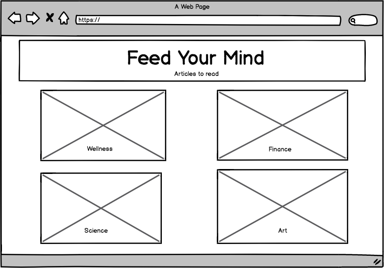

## Project Name: ProjectMe

## Check In: 1

## Project Pitch
 ProjectMe will be your daily source of inspiration and will be an app that you can use as a organizational tool
 to help you keep track of your life goals, short term and long term
Deliverables

## Stack:
 React, Router, Redux, Firebase, Victory.

## APIs:
 TheySaidSo famous quotes API, newsapi.org.

##Wireframes
 
 
 
 
 

## Waffle & Github
url(https://waffle.io/hsanchez7934/ProjectMe) for waffle
url(https://github.com/hsanchez7934/ProjectMe) for github

## Order Of Attack
 Iteration 1: Start fetching data.
 Iteration 2: User should be able to create a goal and should be able to add necessary steps to achieve the goal.
 Iteration 3: Create the My Reasons section of the app, where users can save images of things or people and text that reminds
 them of why they do what they do.
 Iteration 4: Style the crap out of the app.

## MVP
 The app should be able to fetch and send random notifications to remind you to stay on track in accomplishing your goals.
 The app should allow the user to save goals, images, text.
 The app should look really good!
 The app will allow the user to enter financial data, (ex: how much money to save, how much money you make) and reflect, using data visualization, an overview of your saving information through a short term and long term period, A savings calculator.          

## Nice To Haves
 The app would be able to recommend articles to read from other websites on a variety of topics such as wellness,
  financial planning, intellectual stimulation, etc.

 The app should recommend a list of motivational speakers and user should be able to able to view videos of them speaking
 ,from youtube, througt the app itself.

 App should have a section where users of the app can interact with one another, blog posting, idea sharing, story sharing,
 provide ways of interacting/networking.

## Biggest Challenges
 Want to implement a beautiful UI, css will be a challenge.
 Getting off the ground without a comp to follow.
 Implmenting Redux and Router.

## Instructor Notes

- This project has a great spirit but I think that you need to kind of hone in what you really want to accomplish. 
- From a technical standpoint this isn't the most difficult thing, which means we can focus on a lot of the fundamentals 

## Deliverables for next checkin:

- hook up react, redux and router 
- store should be populating with some data 
 - it can be stuff from an api / web scrapped data 
- hook up victoryjs for the landing page. 
