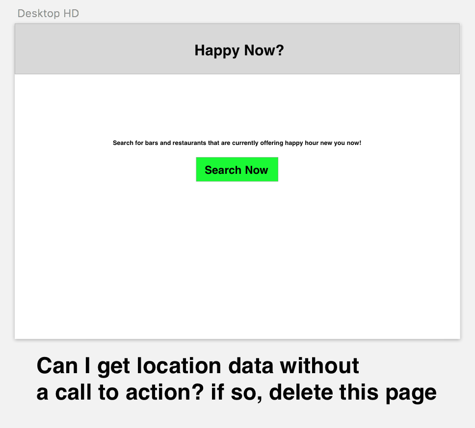
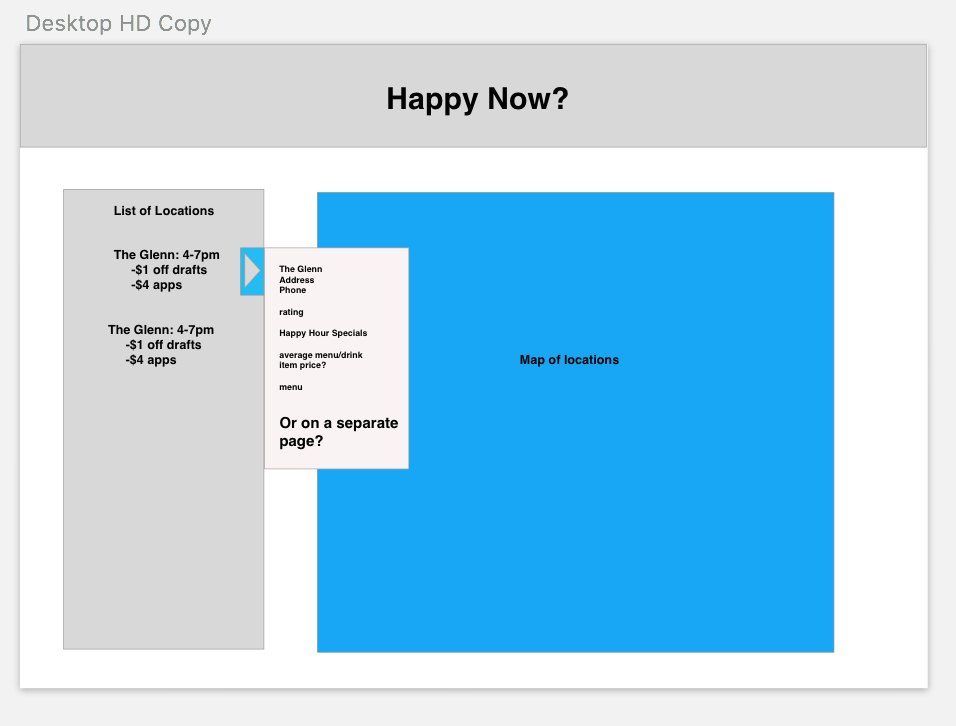

## Project Name: Happy Now?

#### Check In: 3

#### Project Pitch:  
I want to create an app to list any happy hours that are happening at bars and restaurants around a user.  However, I will only be able to display happy hours that are listed on foursquare.  I would also like to include the food menu for any restaurants that have it listed as well.

### Deliverables

#### Stack: 
React 

Reducx 

Router 

Node.js?

#### APIs: 
[foursquare](https://developer.foursquare.com/docs)

[GoogleMaps](https://developers.google.com/maps/documentation/javascript/tutorial)

#### Wireframes

#### Waffle & Github
[GitHub](https://github.com/NikBorn/happy-now)

[Waffle](https://waffle.io/NikBorn/happy-now)

#### Order Of Attack

Build out a boilerplate of all components

Learn how to make an API call with Node.js(make an intial call for bars/restaurants based on current location)

Get familiar with googlemaps(insert the sample map)

Connect Array of locations to display using google maps

Display list identifying closest locations and highlight those with current or upcoming happy hour.

Have link to location showing happy hour specials and food and beverage menu.

#### MVP

(worst case scenario, there is no uniform way to dig into happy hour specials)

search for closest restaurants and bars

display those locations on a map

have a list of locations

have a link to location page displaying 
inforamtion and menu(where restaurants/bars have a menu listed on foursquare)

#### Nice To Haves

Backend for users to save favorite locations.

#### Biggest Challenges

Implementing Node.js and google maps for the first time.

Digging into the menu on foursquare to identify the happy hour specials.

#### Deliverables since checkin:

- Have firebase hooked up (DONE!)
  - a user should be able to sign in (DONE!)
  - have the ability to add a happy hour to the desired resturant / bar 
  - load 10 first (DONE!)
  - save favorites to the backend based off the user (WIP)
- have the app styled (major upgrades, still need some fine-tuning)
- Load google maps into the applicatoin (on-hold)
  - allow the user the ability to see the bars around them. 

#### Instructor Notes

#### Deliverables for next checkin:
- Start testing components / actions 
- Get maps displaying
  - ideally it would be really great to have bars loading on the map 
- change the smiley face into an actual loading gif 
- hook up favorites to the store / firebase
- hook up add happy hour to store / firebase 
