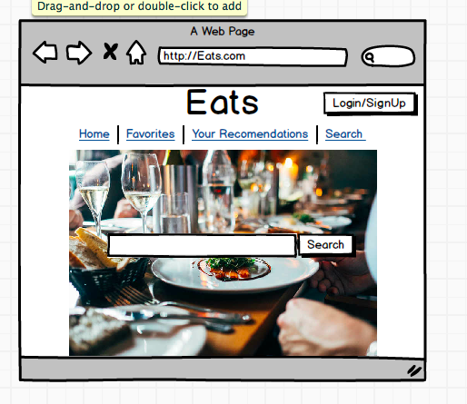
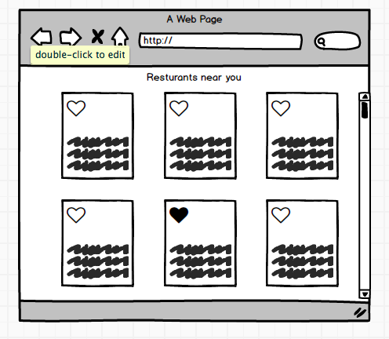
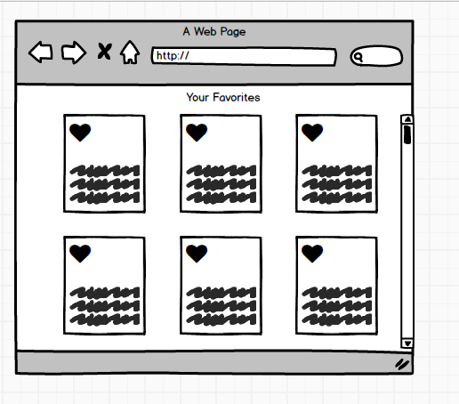
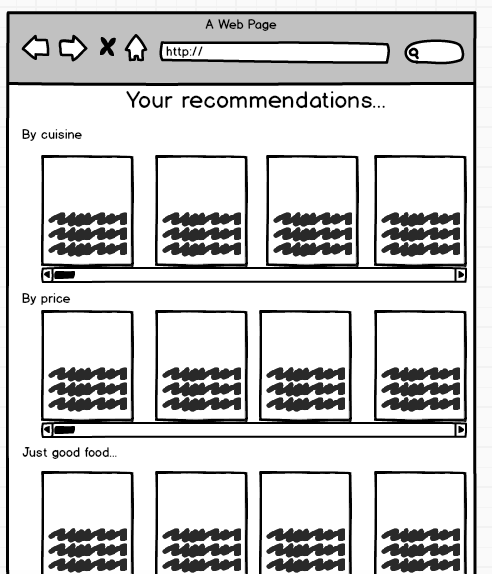

## Project Name:
  Eats

#### Check In: 1

#### Project Pitch

A better version of yelp- less features, simpler, just resturants.
  - sign in and store your favorite resturants/ places you've been
  - recomendations base on your favorite resturants
  - sort through based on food type, price, rating, reservation

### Deliverables:

#### Stack:

React
Redux
Router
Firebase- backend (login)

#### APIs:

[Zomato API](https://developers.zomato.com/api)

maybe [Yelp API](https://www.yelp.com/developers/documentation/v3/business)

#### Wireframes

#### Waffle & Github

[GitHub](https://github.com/jdursema/Eats)
[Waffle] (https://waffle.io/jdursema/Eats)

#### Order Of Attack

1. Set up App, actions, reducers, and helper files.
2. Set up firebase backend
3. Sign in/login form
4. Api fetch request for resturants based on location
5. Set up card display
6. orginize resturants display based on rating, cuisine.
7. Set up favorites
8. Recomendations based on favorites.

#### MVP

User can search resturants near them, create an account, login, add favorites. 

#### Nice To Haves

- recomendations based on their favorites (price range, cuisine, just random good resturants)
- geolocation so they can enter 'my location' into search and it will return results based on 
- auto complete search
- resturant cards information
  - rating
  - reservations?
  - price range
  - open hours

##### Unrealistically abmitious: 

1. Allow people to make groups and recomend other resturants to group members
2. Have a recomended resturant of the day based on the users current location

#### Biggest Challenges

learning firebase
Working with API to display data how i want it to

#### Instructor Notes
* This looks awesome!!

#### Deliverables for next checkin:

* Get API access and get familiar with data
* Get aplication set up with React, Redux, and Router
* Get Firebase set up
* Build out home page (login)
* Add user to the store
* Add routes

