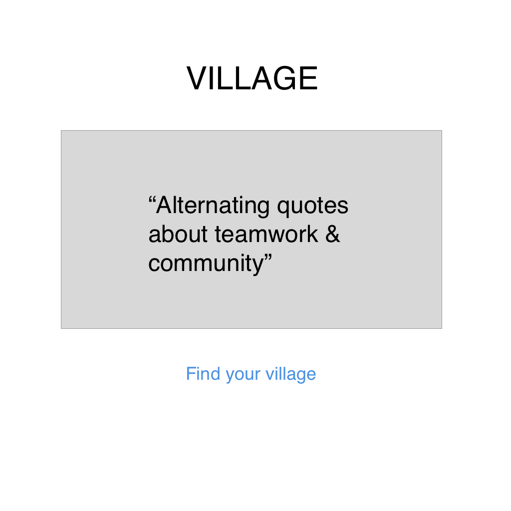
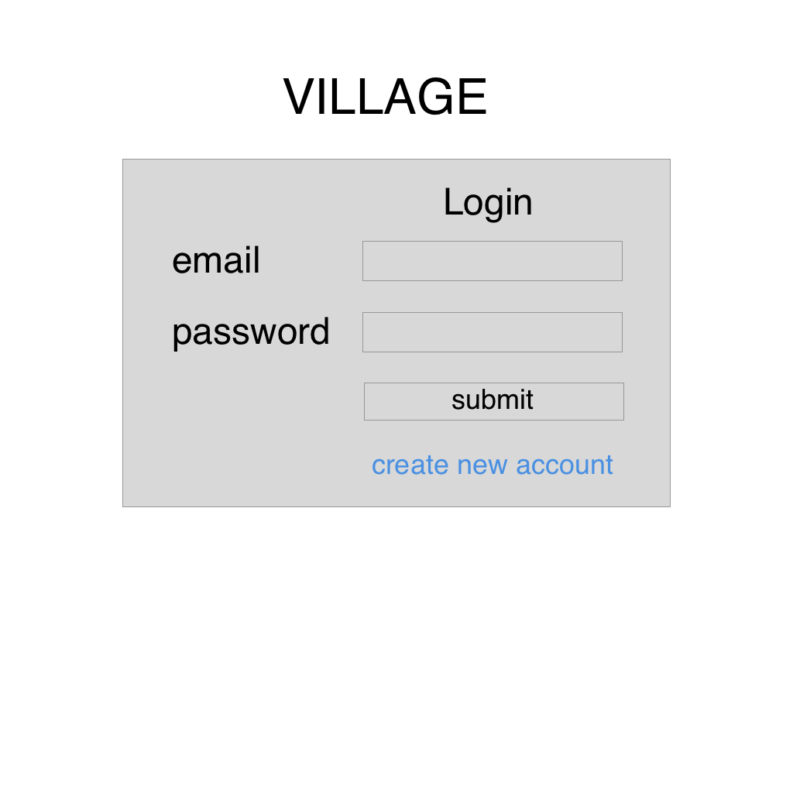
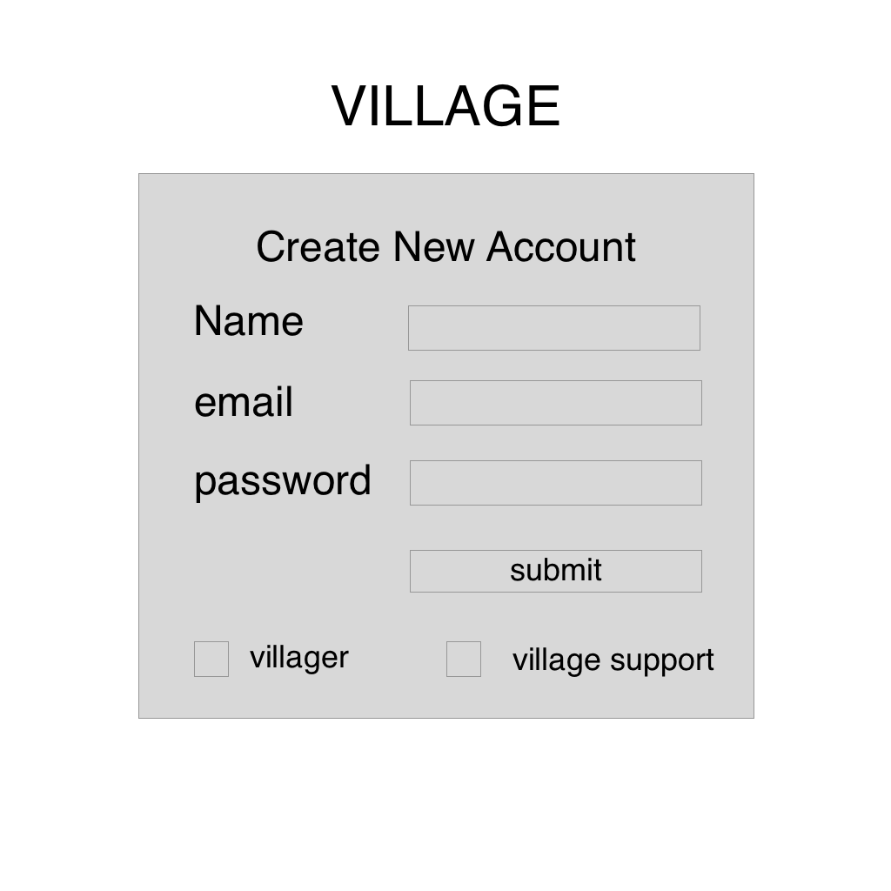
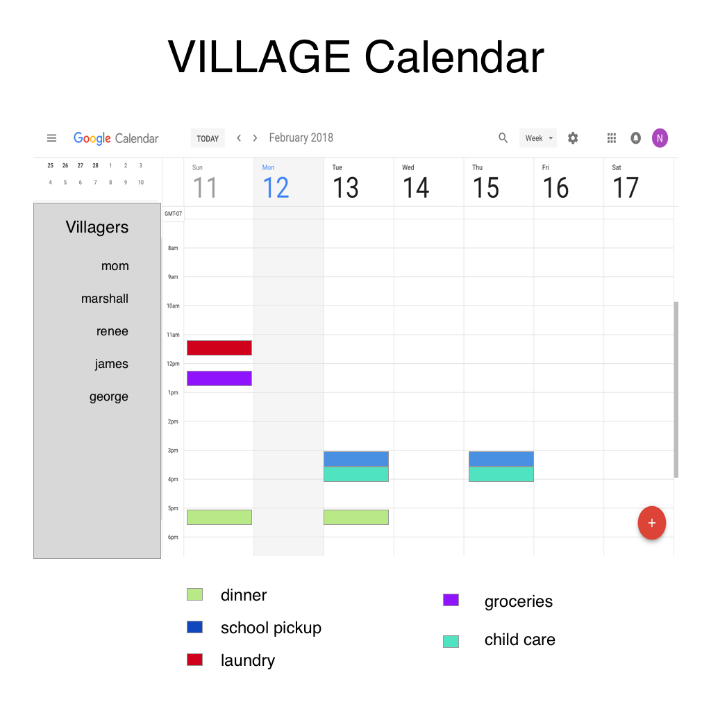
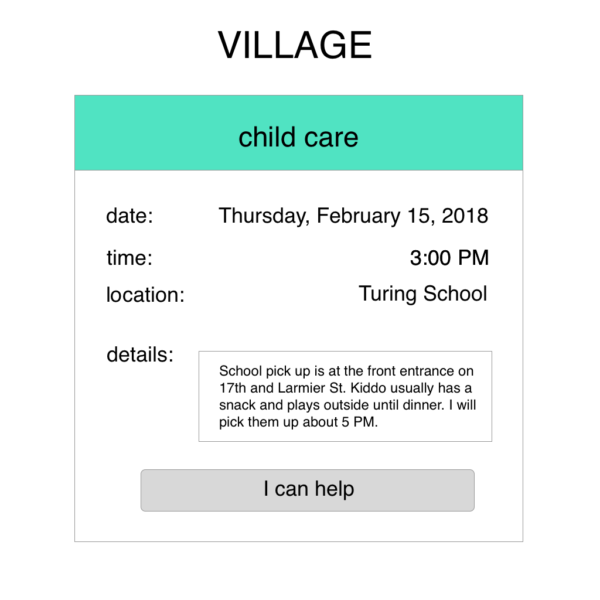

## Project Name: Village 

#### Check In #1

#### Project Pitch 

  Village is a calendar share app for people who are experiencing life events that require help and suppport from family and friends. The villager is the person that need support. They can create their village calendar where they add the things they need help with such as: child care, cooking, cleaning, ect. Their friends and family can join their village and they will have access to the village calendar. In the village calendar, they can sign up to help with the villager's requested needs.

### Deliverables

  A calendar share app.

#### Stack: 

  React and Redux

#### APIs: 

   Google Calendar API will handle:

  -creating events
  -deleting events
  -editing events
  -sharing calendar
  -event propagation
  -reminders and notifications

#### Wireframes

#### Waffle & Github 
  
  Plan to use gitHub issues for project management.

#### Order Of Attack 

  -get a calendar to display
  -navigate site
  -OAuth setup
  -create an event
  -create an account
  -login
  -add users
  -add events while sharing calendar
  -update an event
  -delete an event

#### MVP

  A calendar share app where a villager can create a village that their friends and family can join. The villager can add tasks that they need help with to a shared village calendar. Village members can take on tasks. All events a villager signs up for can be exported to their personal calendar and email reminders will be sent for the event from the calendar.

#### Nice To Haves 

  Use Twilio API to add functionality to text event reminder 12 hours before event

#### Biggest Challenges

  I think I am going to have to create a new google calendar on registration of the villager to store all the data and give me access to all of the api capabilities. I'm not sure how to implement this.

#### Instructor Notes

#### Deliverables for next checkin:
