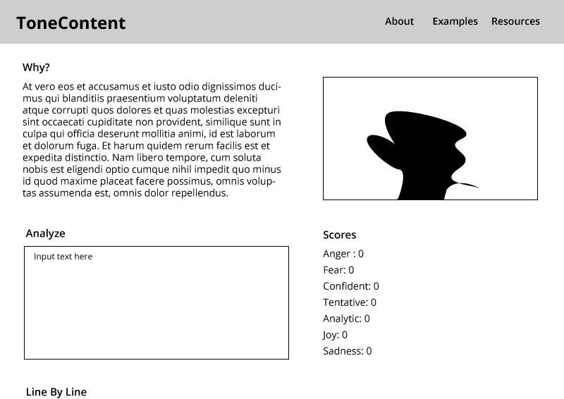

#### Check In (what checkin number is this?)
1

#### Project Pitch
I want to build a web application which assesses text content for tone using the Watson API and gives the user feeback on that content within the context of negotiation and conflict resolution. This web application could be used as a teaching tool for mediators and negotiators, as well as as a tool to provide additional information in written negotiation. 

### Deliverables
I want to build the initial functionality of the application, including posting to and rendering information from the API. I hope to eventually construct a dynamic way to render the analysis of the text, and provide greater additional context and resources which add value to the data being recieved.

#### Stack:
React
Redux/Router

#### APIs:
Watson Tone Analyzer API

#### Wireframes

#### Waffle & Github
I will use Waffle to manage project goals and progress.

#### Order Of Attack
Access API, plan data approach, decide on rendering strategy

#### MVP
Basic API analysis functionality. User inputs a block of text and the application gives general scores and context as feedback. Page explaining balance of different scores.

#### Nice To Haves
Sentence by sentence analysis, context and analysis of examples. Specific feedback for different tone feedback combinations.
Dynamic visual representation of data from a text sample. Potential feedback relative to a given goal, i.e., you specify the role of the speaker or the context and it gives you varied feedback relative to that intended goal. 

#### Biggest Challenges
Determining best strategy for dynamically and rendering useful data, successfully contextualizing results so that they are useful and applicable to application goal.

#### Instructor Notes

#### Deliverables for next check
