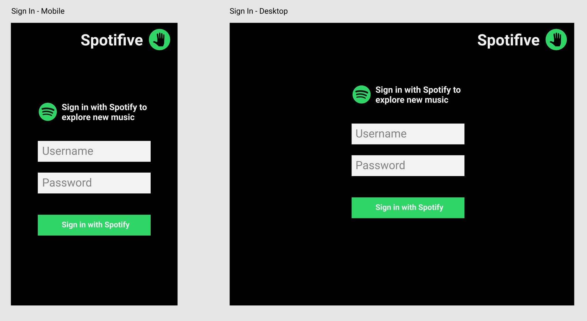
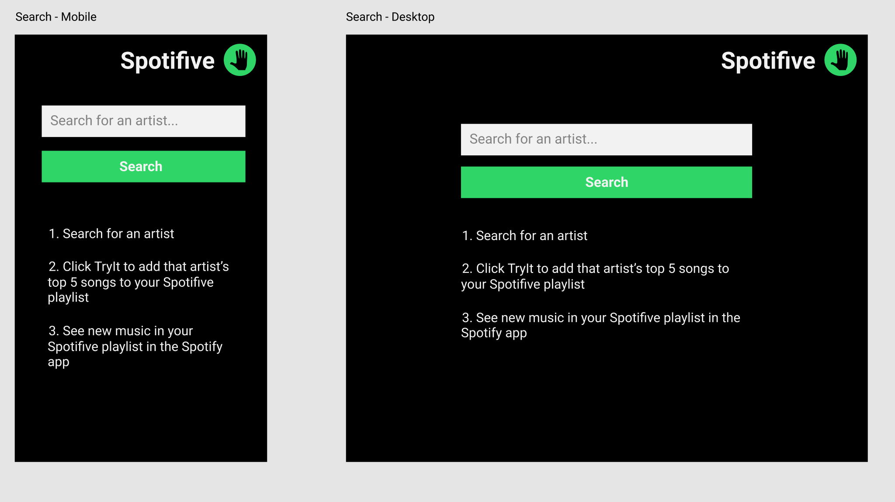
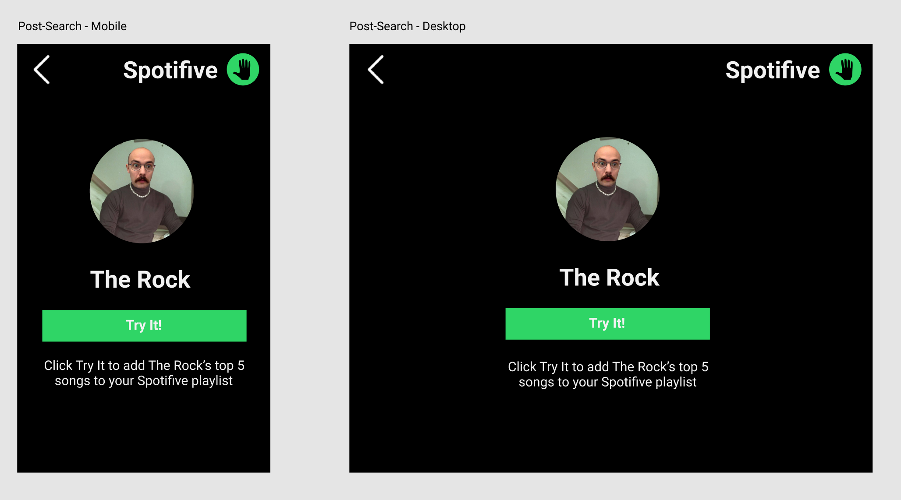
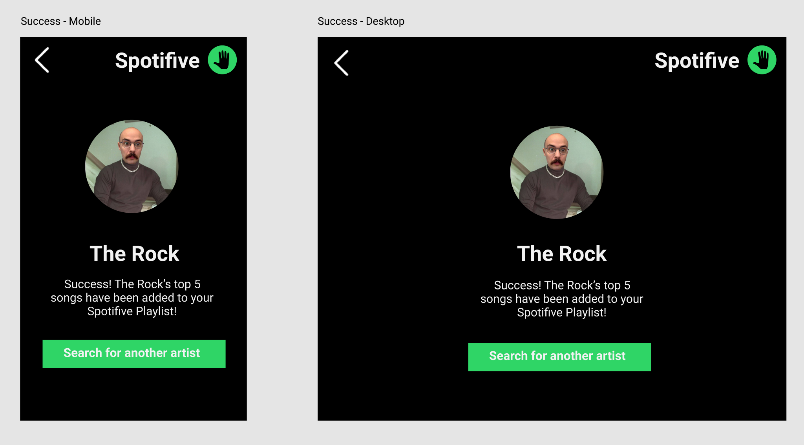

## Project Name: Spotifive

### Check In 1

#### Project Pitch

Imagine you're with your friends listening to music and your friend says, "If you like this song, you should check out this artist." In that moment, you don't have a chance to actually listen to your friend's recommended artist, but you want a way to remember them and queue the new music to listen to later. Spotifive allows you to quickly search for an artist and with one button, add that artist's top 5 songs to a Spotifive playlist in your own Spotify account. Queue up new music recommendations now to listen to later.

### Deliverables

#### Stack:

* React
* Redux
* Router

#### APIs:

* Spotify

#### Wireframes
Figma: https://www.figma.com/file/J65wRINfUHO4r27GRcaZnLjS/Spotifive

Sign In

Search 

Try It

Success

#### Asana

https://app.asana.com/0/681318719662859/board

#### Order Of Attack

* Test
* OAuth / Spotify login
* Search
* Create playlist and add songs
* Style

#### MVP

* Login w/Spotify
* Search for artist
* Adds Spotifive playlist to user account
* Add top 5 songs for selected artist to Spotifive

#### Nice To Haves

* Middleware
* CDN
* Show Artist cover photo and top 5 songs
* Uhow user profile photo & name to indicate signin
* Take me to my Spotifive on Spotify
* Custom Spotifive playlist
* Persist signin (local storage)
* PWA or React Native

#### Biggest Challenges

* OAuth / Express / backend
* lots of fetch...lots of async

#### Instructor Notes

#### Deliverables for next checkin:

* Timeline of features & extensions
* Update Asana with ^^
* Sketch user flow
* npm start to work
* npm test to work
* redux, react-router set up
* fetching some data (if your first thing to do is oauth, I want some scaffolding set up for that)

 
 

