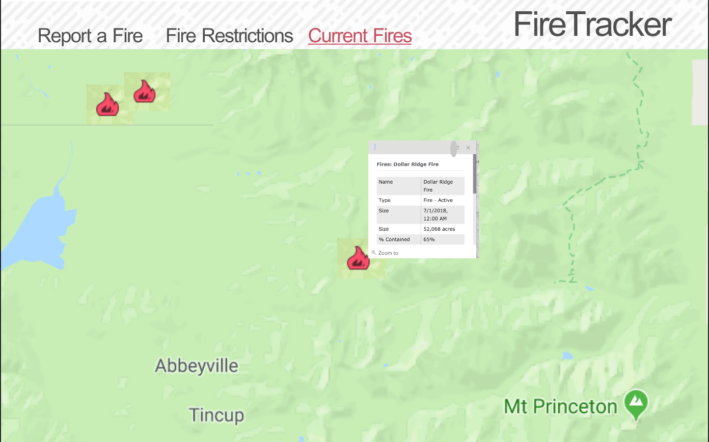
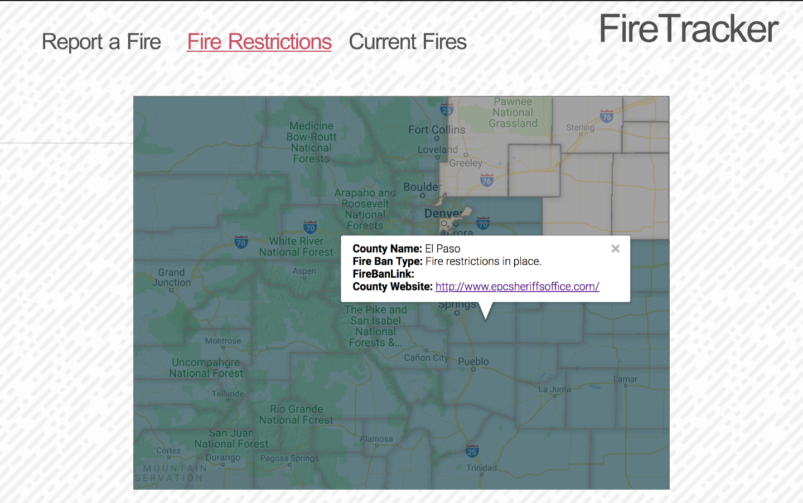
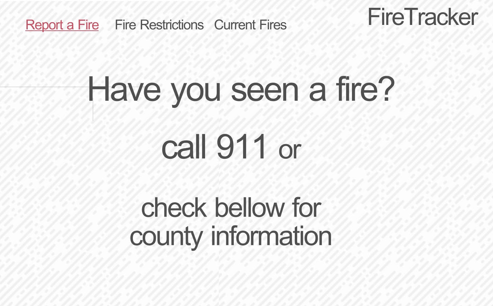

Project Name: colorado-fire

#Check In #1
Project Pitch: This is a webiste that provides information about current wild fire conditions, current fire bans, and information about how to report fires.

#Deliverables
Stack: React,Redux,Router
APIs: GEOMAC, LANDFIRE Data Distribution, google maps
Wireframes:

Github: https://github.com/Awiedenman/colorado-fire

Order Of Attack: in README.md

MVP: v1 will be implementing google maps and creating  markers based on latitude/ longituge information.  The user can select on the points to learn about burn size and containment. 

Nice To Haves: v2 will have the map with county information, fire restrictions and county info.

Biggest Challenges:  Biggest challenges are going to be digging through all this info and finding what is meaningful and usful.

Instructor Notes

Deliverables for next checkin: