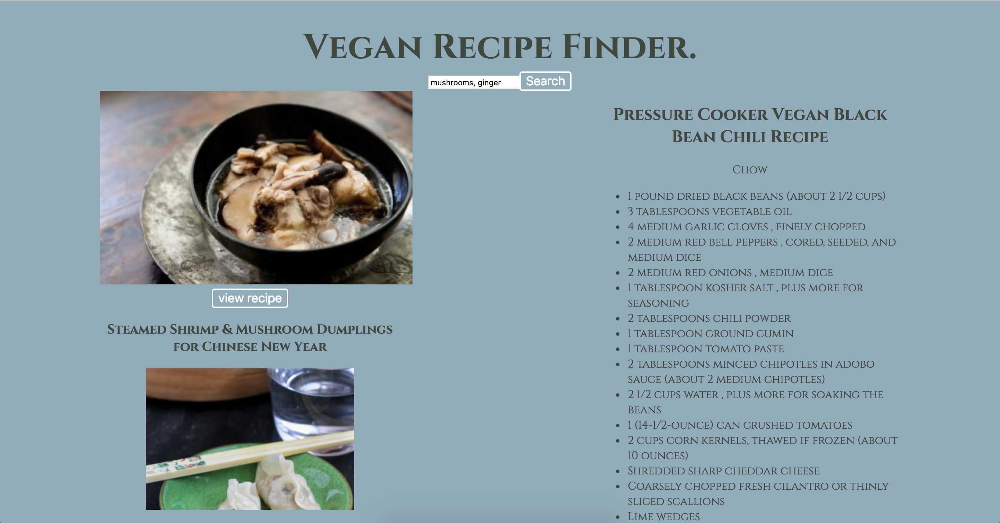

## Project Name:
Vegan Recipe Finder (working title)

#### Check In (what checkin number is this?)
1.
#### Project Pitch
App to allow vegan and vegetarien folk search recipes by ingredient without scrolling through meat products.

### Deliverables
Update this PR. Add updated wireframe with more detail. Add React, Redux and Router boilerplate.

#### Stack:
React, react-redux, router.

#### APIs:
food2fork

#### Wireframes

#### Waffle & Github
Github.

#### Order Of Attack
set up file structure, get and clean data, set up search for recipes, display recipes, potentially add more filters.

#### MVP
Users should be able to search recipes.

#### Nice To Haves
Backend.

#### Biggest Challenges
api filters.

#### Instructor Notes
Update PR. Set up boilerplate, get to work!

#### Deliverables for next checkin:
Update PR. Get api calls working and have data in the Redux store.
