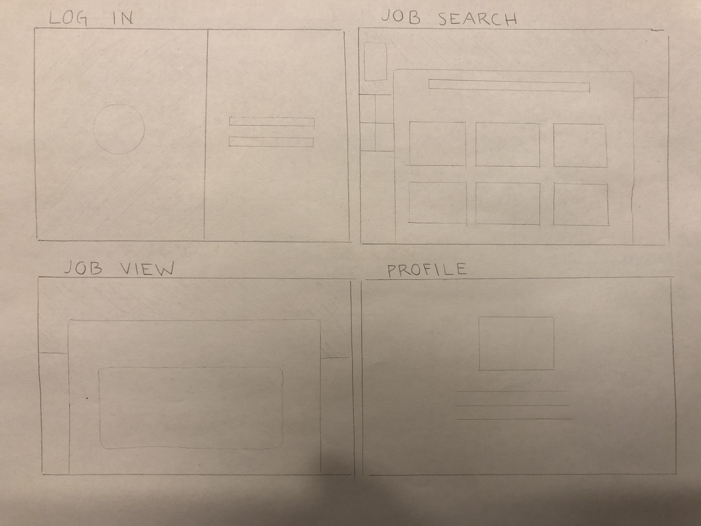
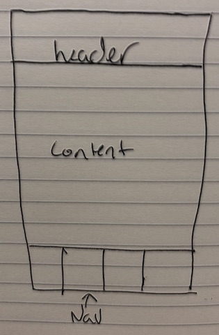

## Project Name:
TBD

#### Check In 1

#### Project Pitch
As I have began my job search I have found it difficult to track all of the jobs I have applied to. I want a way to search for potential jobs and keep track of current applications that are out in the wild, if I have heard a response, had a conversation, been invited to an interview, and days since applying.

### Deliverables

#### Stack:
React Redux Thunk React-Router Webpack

Node Express MongoDB/Mlab or Firebase 🤷🏼

#### APIs:
Github Jobs
Remote OK
https://github.com/marklocklear/remote_gig

**LinkedIN** only if I can get oAuth2 configured

#### Wireframes

#### Waffle & Github
Github For tracking issues.
Link to [repo](https://github.com/andrew-t-james/personal-project).

#### Order Of Attack
* Build out basic outline on Frontend
* TDD Frontend
* Build a back-end for auth and storing data.

#### MVP
* MVP would be a combined search of jobs from RemoteOK, and Github Jobs that is filterable in a search bar.
* The ability to mark a job as applied.
* View jobs that have been applied to

#### Nice To Haves
* Tagging job based on current status of application
* Days since application was submitted.
* OAuth2 to implement LinkedIn integration

#### Biggest Challenges
I feel my biggest challenges will be building out my back-end as I have not done much back-end programming since the start of Turing.

#### Instructor Notes

#### Deliverables for next check-in:
More Wireframes describing user interaction
Make a decision on firebase