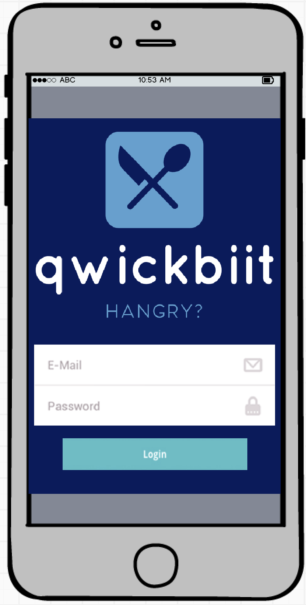
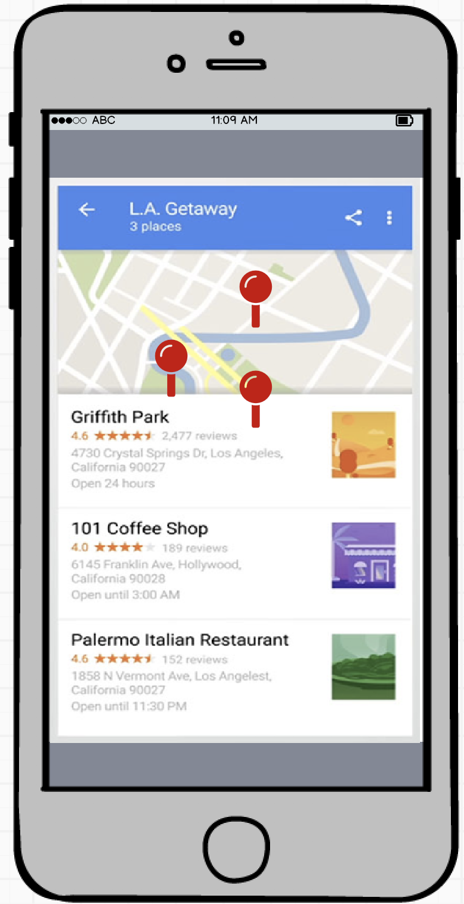
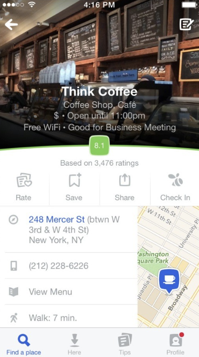
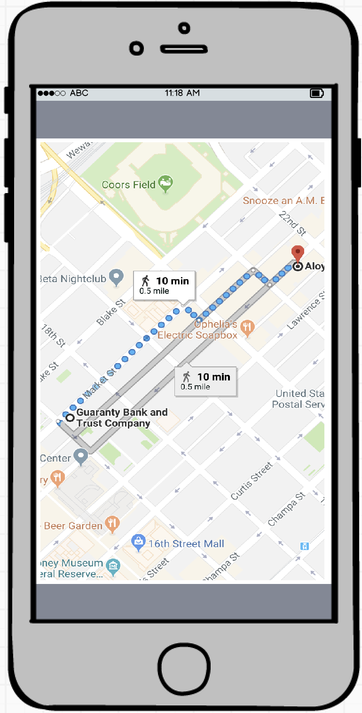

## Project Name: qwickbiit

#### Check In 1

#### Project Pitch
the app displays open restaurants within a one mile radius eliminating wasted time sorting through the stack. User can filter by price, cuisine, and open reservations. 

### Deliverables

#### Stack: React, Redux, Router, Thunk

#### APIs: Google, Resy, yelp

#### Wireframes

#### Github

#### Order Of Attack
React, Redux, Router boiler plate setup.
Capture restaurant data.
Render Google maps.
mobile first design.

default: filter restaurants that are open
filter by price range
filter by cuisine
filter by open reservations
make reservation

#### MVP
App shows what restaurants are open within given radius.

#### Nice To Haves
price filter
cuisine filter
open reservations filter
make reservations

#### Biggest Challenges
finding and making reservations

#### Instructor Notes

#### Deliverables for next check-in:
